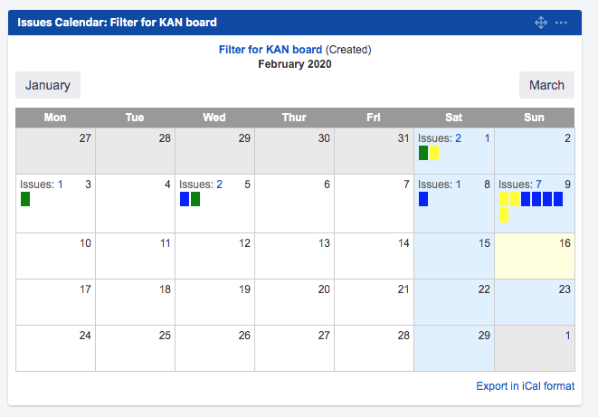

# Jira-Calendar-Plugin-By-StatusColors
Plugin of Jira Calendar Gadget modified to show the issue colors by StatusCategory instead of Priority. Compatible with Jira 7.x and Jira 8.x

File for Jira 7.x
[Download Jira Calendar Plugin for Jira 7 by MrAddon](jira-calendar-plugin-7.0.1-MRADDON.jar)

File for Jira 8.x
[Download Jira Calendar Plugin for Jira 8 by MrAddon](jira-calendar-plugin-8.0.1-MRADDON.jar)

Original repo from Atlassian:
https://bitbucket.org/atlassian/jira-calendar-plugin/src/master/
